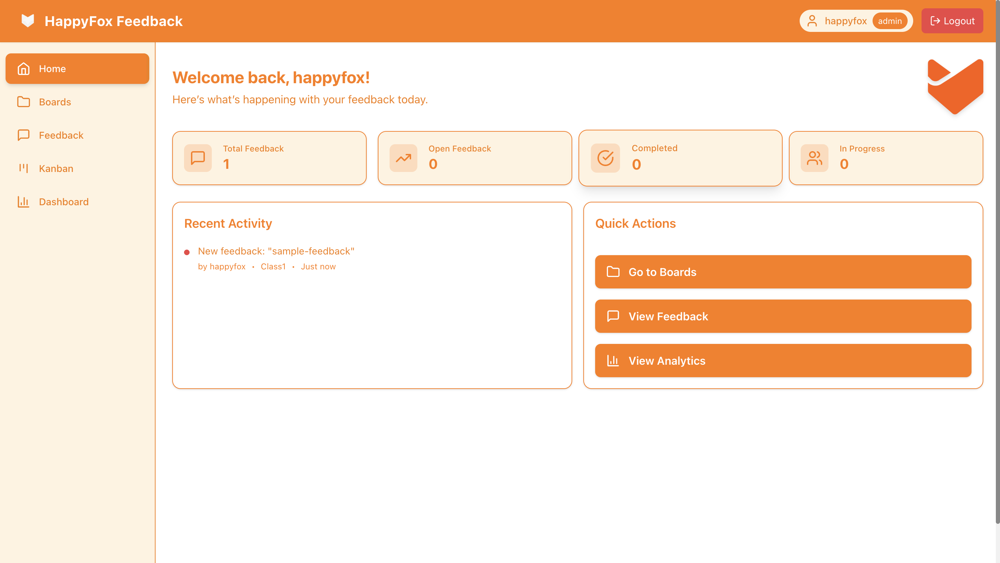
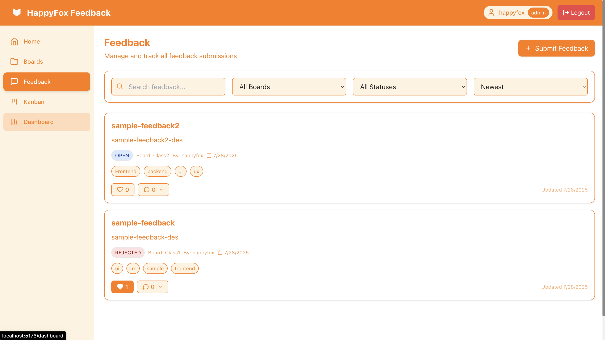
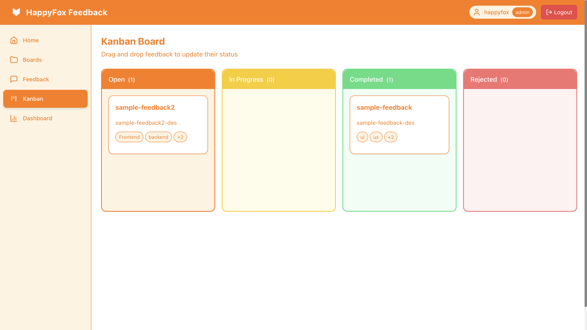
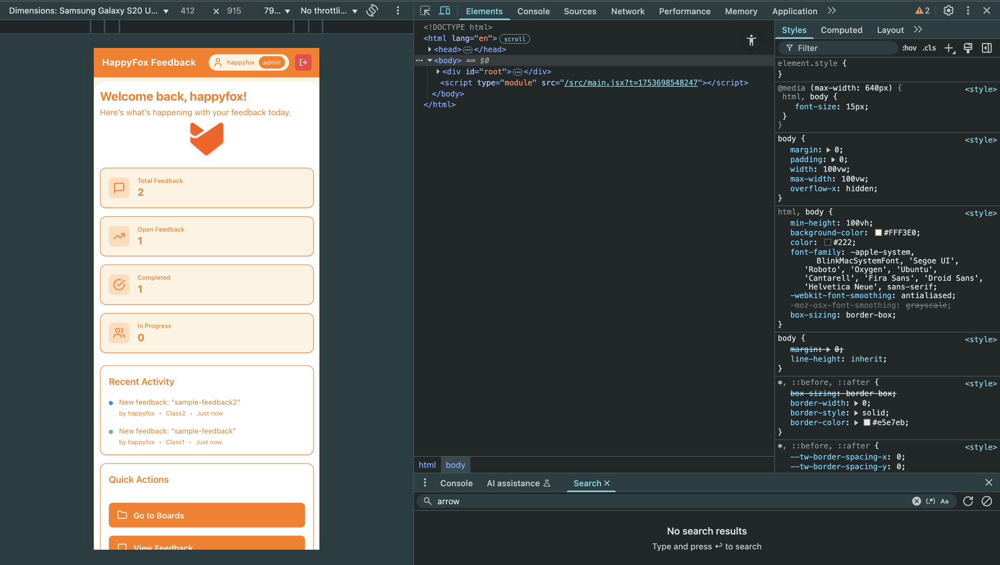

# 🎯 Feedback Management System

A comprehensive feedback management application built with Django REST Framework and React that helps businesses effectively gather, prioritize, and act on customer feedback. This system enables customers to submit, vote on, comment on, and track feedback progress while providing product teams with powerful tools to manage the feedback lifecycle.



## 📋 Table of Contents

- [Overview](#overview)
- [Key Features](#key-features)
- [Tech Stack](#tech-stack)
- [Architecture](#architecture)
- [Unique Features](#unique-features)
- [Installation](#installation)
- [Screenshots](#screenshots)
- [Project Structure](#project-structure)
- [Contributing](#contributing)

## 🌟 Overview

The Feedback Management System is designed to bridge the gap between customers and product teams by providing:

- **For Customers**: An intuitive platform to submit feedback, vote on existing suggestions, and track progress
- **For Product Teams**: Comprehensive tools to organize, prioritize, analyze, and manage feedback effectively
- **For Organizations**: Data-driven insights to make informed product decisions

## 🚀 Key Features

### Core Functionality
- ✅ **CRUD Operations** for Boards, Feedback, and Comments
- ✅ **Role-Based Access Control** (Admin, Moderator, Contributor)
- ✅ **Public/Private Boards** with member management
- ✅ **Upvoting System** for feedback prioritization
- ✅ **Status Workflow** (Open → In Progress → Completed/Rejected)
- ✅ **Tagging System** for better organization

### Multiple Data Views
- 📊 **Table View** with sorting, filtering, and pagination
- 🗂️ **Kanban Board** with drag-and-drop status updates
- 🔄 **Real-time Status Updates** across all views
- 📱 **Responsive Design** for all device types

### Analytics & Dashboard
- 📈 **Comprehensive Dashboard** with key metrics
- 📊 **Interactive Charts** (Line, Bar, Pie) using Chart.js
- 🎯 **Top-voted Feedback** tracking
- 📅 **Submission Trends** (daily, weekly, monthly)
- 🏷️ **Tag Distribution** analysis
- 🔍 **Advanced Filtering** by date range, status, tags

## 🛠️ Tech Stack

### Backend
- **Framework**: Django 4.2.23 + Django REST Framework 3.16.0
- **Authentication**: JWT with Simple JWT 5.5.1
- **Database**: SQLite (development) / PostgreSQL (production ready)

- **CORS**: django-cors-headers
- **Testing**: pytest-django

### Frontend
- **Framework**: React 18.2.0 with Vite 5.0.8
- **Routing**: React Router DOM 6.8.0
- **Styling**: Tailwind CSS 3.4.0 with custom HappyFox theme
- **HTTP Client**: Axios 1.6.0
- **Charts**: Chart.js 4.4.0 + react-chartjs-2 5.2.0
- **Drag & Drop**: @dnd-kit/* (Kanban functionality)
- **Icons**: Lucide React 0.263.1
- **Notifications**: React Hot Toast 2.4.1

### Development Tools
- **Linting**: ESLint with React hooks and refresh plugins
- **Build Tool**: Vite (fast HMR and optimized builds)
- **CSS Processing**: PostCSS + Autoprefixer
- **Package Manager**: npm

## 🏗️ Architecture

### Backend Architecture
```
📦 Django Backend
├── 🔐 Authentication (JWT-based)
├── 👥 User Management (Role-based permissions)
├── 📋 Board Management (Public/Private with members)
├── 💬 Feedback Management (CRUD + Upvoting)
├── 💭 Comment System (Threaded discussions)
├── 📊 Analytics Engine (Real-time aggregations)
└── 🔌 RESTful API (Fully documented)
```

### Frontend Architecture
```
📦 React Frontend
├── 🎨 Component Library (Reusable UI components)
├── 🚦 Context API (Global state management)
├── 🛣️ React Router (SPA navigation)
├── 📡 API Layer (Axios with interceptors)
├── 🎯 Custom Hooks (Reusable logic)
├── 🎨 Tailwind Styling (Custom theme)
└── 📱 Responsive Design (Mobile-first approach)
```

## ⭐ Unique Features

### 🎨 Custom HappyFox Branding
- **Custom Color Palette**: Integrated HappyFox orange theme throughout the application
- **Branded Components**: Custom styled components matching HappyFox design guidelines
- **Logo Integration**: HappyFox logos used across login, splash screen, and navigation
- **Consistent Typography**: Carefully chosen fonts and spacing for professional appearance

### 🔄 Real-time Drag & Drop
- **Kanban Board**: Fully functional drag-and-drop interface for status updates
- **Optimistic Updates**: Immediate UI feedback with server sync
- **Error Handling**: Graceful rollback on failed operations
- **Smooth Animations**: CSS transitions for enhanced user experience

### 📊 Advanced Analytics
- **Multi-timeframe Analysis**: 7, 30, 90-day views
- **Interactive Charts**: Hover effects, tooltips, and legends
- **Trend Analysis**: Visual representation of feedback patterns
- **Export Ready**: Charts optimized for reporting

### 🔒 Sophisticated Permission System
- **Granular Permissions**: Different access levels for different operations
- **Board-level Security**: Private boards with member-only access
- **Content Ownership**: Users can only edit their own content (with moderator override)
- **API Security**: JWT-based authentication with automatic token refresh

### 📱 Mobile-Optimized Experience
- **Responsive Navigation**: Collapsible sidebar for mobile devices
- **Touch-Friendly**: Large touch targets and intuitive gestures
- **Performance Optimized**: Lazy loading and code splitting
- **PWA Ready**: Can be installed as a mobile app

### 🎯 Smart Filtering & Search
- **Multi-criteria Filtering**: Search by title, description, status, board, tags
- **Real-time Search**: Instant results as you type
- **Sort Options**: Multiple sorting criteria with ascending/descending options
- **Persistent Filters**: Filters maintain state across navigation

## 🚀 Installation

### Prerequisites
- Python 3.8+
- Node.js 16+
- npm or yarn

### Backend Setup
```bash
# Clone the repository
git clone <repository-url>
cd feedback-management/backend

# Create virtual environment
python -m venv venv
source venv/bin/activate  # On Windows: venv\Scripts\activate

# Install dependencies
pip install -r requirements.txt

# Run migrations
cd feedback_mgmt
python manage.py migrate

# Create superuser
python manage.py createsuperuser

# Start development server
python manage.py runserver
```

### Frontend Setup
```bash
# Navigate to frontend directory
cd frontend

# Install dependencies
npm install

# Start development server
npm run dev
```

### Access the Application
- **Frontend**: http://localhost:5173
- **Backend API**: http://localhost:8000/api/
- **Admin Panel**: http://localhost:8000/admin/


### Authentication 
- `POST /api/auth/register/` - User registration
- `POST /api/auth/login/` - User login
- `GET /api/auth/me/` - Get current user
- `POST /api/token/refresh/` - Refresh JWT token

### Boards
- `GET /api/boards/` - List boards
- `POST /api/boards/` - Create board (Admin only)
- `GET /api/boards/{id}/` - Board details
- `PATCH /api/boards/{id}/` - Update board

### Feedback
- `GET /api/feedback/` - List feedback (with filtering)
- `POST /api/feedback/` - Create feedback
- `POST /api/feedback/{id}/upvote/` - Toggle upvote
- `GET /api/feedback/summary/` - Analytics dashboard data

### Comments
- `GET /api/comments/` - List comments
- `POST /api/comments/` - Create comment
- `PATCH /api/comments/{id}/` - Update comment
- `DELETE /api/comments/{id}/` - Delete comment

## 📸 Screenshots

### Login & Authentication

*Clean, branded login interface with form validation*

### Dashboard & Analytics

*Comprehensive analytics with interactive charts and key metrics*

### Boards Management

*Board overview with public/private indicators and member counts*

### Feedback Table View

*Sortable, filterable table with advanced search capabilities*

### Kanban Board

*Drag-and-drop Kanban board for visual status management*

### Mobile Responsive

*Fully responsive design optimized for mobile devices*

## 📁 Project Structure

```
feedback-management/
├── backend/
│   └── feedback_mgmt/
│       ├── core/                 # Main application
│       │   ├── models.py         # Data models
│       │   ├── views.py          # API views
│       │   ├── serializers.py    # API serializers
│       │   ├── permissions.py    # Custom permissions
│       │   └── urls.py           # URL routing
│       ├── feedback_mgmt/        # Project settings
│       └── requirements.txt      # Python dependencies
└── frontend/
    ├── src/
    │   ├── components/           # Reusable components
    │   │   ├── Common/           # Generic components
    │   │   ├── Layout/           # Layout components
    │   │   └── Comment/          # Comment components
    │   ├── views/                # Page components
    │   ├── api/                  # API layer
    │   ├── context/              # React context
    │   ├── utils/                # Utility functions
    │   └── assets/               # Static assets
    ├── public/                   # Public assets
    └── package.json              # Node dependencies
```

## 🎯 Key Implementation Highlights

### Custom Permission System
```python
class IsBoardMemberOrPublic(permissions.BasePermission):
    def has_object_permission(self, request, view, obj):
        if obj.public:
            return True
        return request.user in obj.members.all()
```

### Advanced Filtering
```python
def get_queryset(self):
    queryset = Feedback.objects.select_related('created_by', 'board')
    
    # Role-based filtering
    if user.role not in ['admin', 'moderator']:
        queryset = queryset.filter(
            Q(board__public=True) | Q(board__members=user)
        ).distinct()
    
    # Dynamic filtering and search
    # ... (filtering logic)
```


## 🤝 Contributing

1. Fork the repository
2. Create a feature branch (`git checkout -b feature/amazing-feature`)
3. Commit your changes (`git commit -m 'Add amazing feature'`)
4. Push to the branch (`git push origin feature/amazing-feature`)
5. Open a Pull Request


## 🙏 Acknowledgments

- **HappyFox** for the design inspiration and branding guidelines
- **Django Community** for the excellent framework and ecosystem
- **React Community** for the powerful frontend tools and libraries
- **Chart.js** for the beautiful and interactive charting capabilities

---

**Built with ❤️ using React & Django for HappyFox Evaluation**
